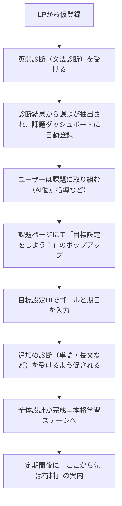
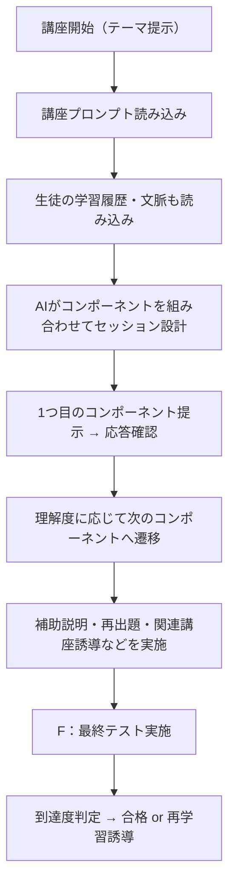

了解です。では、情報を圧縮せず、あなたの構想を**一貫した視点で丁寧に言語化・拡張**した「UI/UX構造設計書」として、より**厚みのあるドキュメント風まとめ**をお渡しします。
以下、文章量は増えますが、全体の**設計思想 → 画面群 → 導線フロー → ユーザー体験の心理変化**まで踏み込んで記述しました。

---

## 🧭 ROUTE UI / UX構造設計（詳細ドキュメント ver.1.0）

---

### ◆ 1. サービス全体のUI設計思想

ROUTEの学習体験は、学習者が自分の課題と目標を**自覚し、構造的に理解しながら、最適な学習課題へ自動的に導かれていく**ことに主眼が置かれている。
この設計においてUIは、ただの画面設計ではなく「思考と行動をつなげるガイドレール」の役割を果たす。

キーメッセージは次の通り：

> **「目標を設定すれば、課題が自然と湧いてくる」**
> **「自分に必要な課題だけが、必要なタイミングで提示される」**

この体験を実現するために、以下の3つの主要UIモジュールが配置される。

---

### ◆ 2. メインUIモジュール群とその役割

#### 🎯 ① 目標設定UI（司令塔的存在）

* ユーザーはここで、学習の最終到達目標（例：共通テスト60点以上）や、目標達成までの期限（例：あと8ヶ月）を入力。
* 入力された目標と、各分析ツールから得られた実力データ（文法、語彙、構文、長文、リスニングなど）を突き合わせる。
* その差分に応じて、「現在から目標までに必要な学習総量」と「残り期間」を基に、課題の**量・種類・配信ペース**を自動で調整する。
* 「目標を高くすると課題が増え、下げると減る」というフィードバック設計により、自分で学習量を調整しながらやる気を出せるUX。

✅ **UX的狙い**：

* 自己決定感と納得性のある課題量設定
* 課題量の変動による「やる気のスイッチ」誘導

---

#### 🗂️ ② 課題ダッシュボード（学習のハブ）

* 各分析結果・目標設定結果に基づき、ユーザーに適切な課題が一覧形式で配信される。
* カテゴリ：文法／語彙／長文読解／リスニング／構文解釈。
* 各課題項目はクリックで「AI個別指導セッション」や「外部教材（市販書籍ベース）」などの学習ツールに遷移。
* 市販教材は事前に登録・分析済のものを活用。自動的に分野ごと・レベルごとに割り当てられる。
* 学習の進捗に応じて、完了／改善中／再挑戦などのステータスがつく設計を検討。

✅ **UX的狙い**：

* やるべきことが一目でわかる安心感
* 過剰情報の排除と、必要なだけの導線提示

---

#### 🕒 ③ 学習ログページ（学習の軌跡を可視化）

* 過去に行った診断、課題、AI指導のセッション履歴などが時系列順に並ぶ。
* 「何をいつやったのか」「どんな診断結果が出たのか」「改善された項目は何か」を俯瞰できる。
* 初回体験（英弱診断）もこの履歴に残るため、ログイン後すぐに「自分の学習体験がそこにある」感覚を得られる。

✅ **UX的狙い**：

* 成果の可視化 → 継続意欲の強化
* 復習・見直しのきっかけ設計

---

### ◆ 3. 個別機能詳細：分析・生成・配信サイクル

---

#### 🔍 文法診断（旧：英弱診断）

* 生徒の英作文をもとに、AIによる文法添削＆診断を実施。
* 添削→フィードバック→弱点抽出→対策課題の提示までを1セッションで完結。
* 診断には「レベルタグ」があり、簡単・標準・難問などを選んで受けることで、より柔軟な実力測定が可能。

👉 **診断のUXサイクル**：

1. 診断を受ける
2. フィードバックを得る
3. 弱点が明確化される
4. ダッシュボードに対策課題が追加される
5. 再度診断を受け、改善が可視化される

---

#### 🤖 AIチューター（非表示のバックエンド支援）

* Meta分析によって可視化された弱点（例：「関係代名詞の目的格での誤用」など）をもとに、
* 事前に登録された「対策講座群（教材ライブラリ）」から、該当するものを自動選出し、課題として配信。
* この処理は完全に裏で行われ、ユーザーは「ちょうどよい課題が出てきた」と感じるUXになる。

---

#### 📚 市販教材との連携（ロードマップ案）

* 書籍（例：ターゲット1900、NextStageなど）の構造をあらかじめDB化。
* 分野別・重要度別に分解し、ユーザーの分析結果と紐づけて「今このページをやるとよい」と自動提案。
* 将来的には、該当ページの演習後に「理解度テスト」を出し、習熟度トラッキングまで可能に。

---

### ◆ 4. オンボーディングUX（ユーザー導線）

---

#### 🔰 初回体験からのステップ設計（MVP構成）

---

#### 📌 UX的設計ポイント（心理の流れ）

| ステージ  | 体験内容            | ユーザー心理の移行            |
| ----- | --------------- | -------------------- |
| LP→診断 | 診断を受け、自分の弱点が見える | 「当たってる」「なるほど」→共感・信頼感 |
| 課題配信  | 対策課題が出てくる       | 「今やるべきことが明確」→安心      |
| 目標設定  | 課題量が調整できる       | 「自分でコントロールできる」→納得感   |
| 追加診断  | 自分に合った設計に変わっていく | 「パーソナライズされてる」→没入     |
| 課金導線  | 一通りやって満足→継続したい  | 「価値あるからお金払おう」→課金許容   |

---

## ◆ 5. 学習用ツール（AIインタラクティブ授業モジュール）

---

### 🎓 概要と目的

学習用ツールは、特定の学習テーマ（例：「aとtheの使い分け」）に対して、AIが動的に選択可能な**複数の学習コンポーネント**を活用しながら、
生徒の理解を深め、必要に応じて補助説明や弱点補完を挟みつつ、最終的に「習得した」と判定できる状態に導くインタラクティブ学習体験である。

このツールは、以下の2つの情報を統合して作動する：

1. **講座ごとのシステムプロンプト**
2. **生徒の学習コンテクスト（分析ツールで得られた情報）**

---

### 🔧 5-1. 講座単位でのプロンプト設計

各講座（＝1テーマ）には、以下を含む**専用の指導仕様プロンプト**が設定される：

* このテーマで扱うべき知識（どの範囲、どの難易度）
* 重視する理解の切り口（例：意味的区別、語用論、発話文脈など）
* 推奨される学習フロー（例：まず日本語説明 → 作文 → 誤用指摘）
* テスト形式と合格基準（どのような出力ができれば「理解した」と判定できるか）

これにより、各学習テーマにおける「AIの振る舞い」がブレず、再現性のある学習セッションが可能となる。

---

### 🧠 5-2. 生徒の学習コンテクストとの統合

AIは、講座プロンプトだけでなく、以下のような**個別生徒データ**も参照して学習セッションを調整する：

* 過去の診断履歴（例：文法診断にて定冠詞の誤用が頻発）
* 現在の到達度（目標設定との差分）
* 習熟済み・未習分野のリスト
* 他分野との関連性（例：「aとthe」が長文の意味理解にも影響している）

これにより、AIは「今、この生徒にとってどのアプローチが最適か」を判断し、**以下の学習コンポーネント**から動的に最適な流れを選択する。

---

### 🧩 5-3. 学習コンポーネント一覧

| 番号 | 名称          | 内容                   | 役割・UX効果        |
| -- | ----------- | -------------------- | -------------- |
| A  | 作文添削コンポーネント | 生徒が例文を英作文 → AIが添削・解説 | 誤用からの気づき／実践型理解 |
| B  | 日本語解説＋対話応答  | 概念説明 → 生徒が質問や要約で応答   | 理論的理解／安心の知識定着  |
| C  | ライトな対話誘導    | 「知っていることを言ってみて」など    | 認知の活性化／動機づけ    |
| D  | メディア提示型     | 動画・スライドなどを提示し学習      | 視覚・音声による多様な刺激  |
| E  | 文脈埋込型       | 文中で意味を問う問題で実感させる     | 使用感の理解／長文力連携   |
| F  | 最終テスト型      | テーマ内での理解確認問題         | 達成感／習得ステータス更新  |

---

### 🔄 5-4. 学習セッション全体の流れ（AI側ロジック）

---

### 📌 UX設計上の狙い

* **没入感のある学習フロー**：AIとのやり取りが“その場で授業を受けている”ように感じられる
* **一貫したストーリー**：講座ごとの指導設計が、セッションの芯をぶらさない
* **文脈に応じた柔軟性**：弱点補完・寄り道学習も自然に入り込める設計
* **最後のテストで「自分で理解した感」が得られる**：学習の自己効力感が高まる

---

## 🔗 全体構造への統合位置

この「学習用ツール」は、**課題ダッシュボードに配信された課題の中身を構成する主要モジュール**です。

* 課題ダッシュボード上では「aとtheの違いを学習する」というカードが表示
* クリックすると、この\*\*学習セッション（AIとの対話型講座）\*\*が開始
* 修了時には「クリア」ステータスが付き、学習ログにも記録される

---

必要であれば、この仕様をコード・DBモデル・API設計にも落とし込んでいけます。

次はどの部分を実装の形にしていきましょうか？（例：1テーマ分の講座プロンプト例を書く、など）
